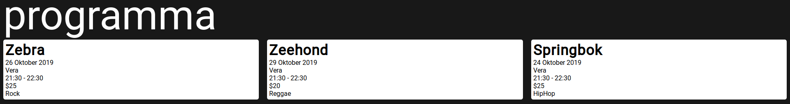
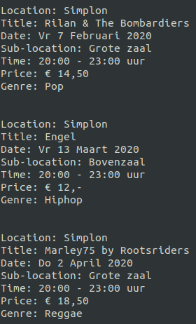

# 050events

## idea
the idea is to create a site and possibly app that notifies you of live performances this week in groningen. this will make it easier for students to quickly see what is new in town and make them not miss anything. i also want to promote local artists by highlighting them. the info on the site should be able to be filtered by date, price, genre and venue.
## site
here is a general idea of what i want the site to look like: 

## code ouput
i have only made a good effort to get the code output of the simplon site, i will also try to do this with vera and spot. here's the output for now 
